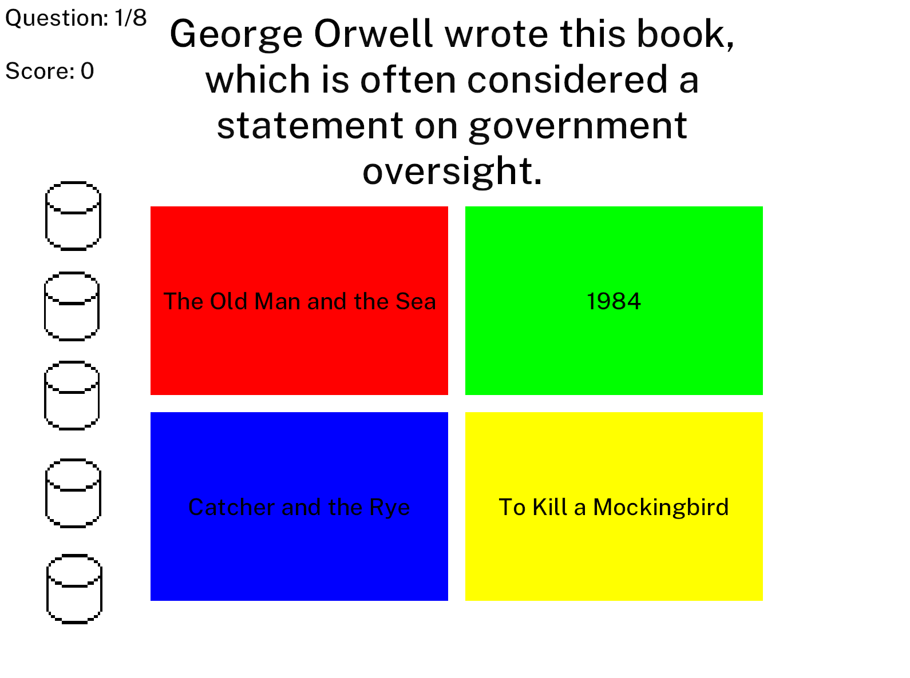
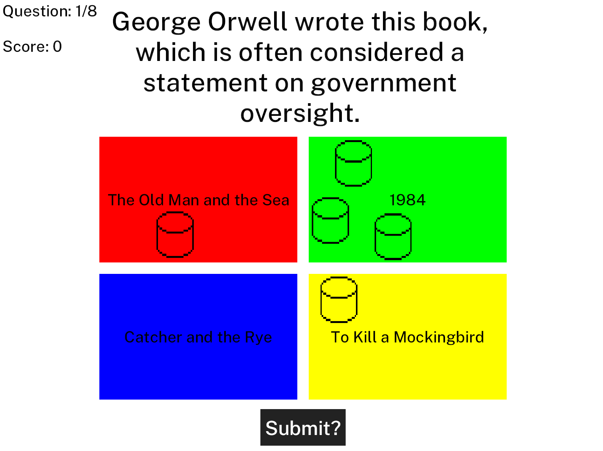
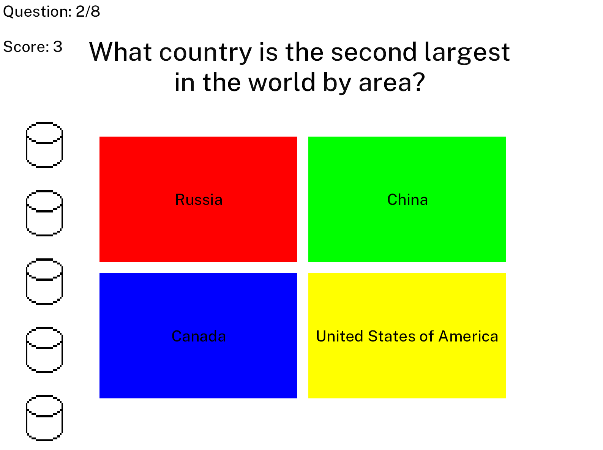

# PrettySure

## Summary
PrettySure is a trivia game, but rather than only allowing you to select one right answer, you can select several with varying levels of confidence. This confidence is represented by "tokens." You can drag these tokens onto the answers you wish to wager them on, and once all tokens have been wagered, a submit button will appear at the bottom of the screen. If you're ready to lock in your answer, click that button! The correct answer will be highlighted, and you will receive one point for every token you wagered correctly. Every round of PrettySure consists of 8 questions, for a total possible 40 points. See how close to the full 40 you can get!

## Example Play
At first, all tokens are on the lefthand side of the screen, and colorless.

After distributing the tokens, the Submit button appears on the bottom of the screen. Note that the tokens have taken on the color of the answers they are wagered on.

After hitting Submit, points are awarded, and tokens reset for the start of another question.

Play continues until you have progressed through all 8 questions. Good luck!

## Acknowledgements
- PrettySure was written using [Bevy](https://bevyengine.org/), an open source Rust game engine.
- All questions are provided by the [OpenTDB](https://opentdb.com/) under the Creative Commons Sharealike License, 4.0.
- The [PublicSans](https://fonts.google.com/specimen/Public+Sans) font is provided under the SIL Open Font License.

## License
This work is licensed under the GNU General Public License, v3.

