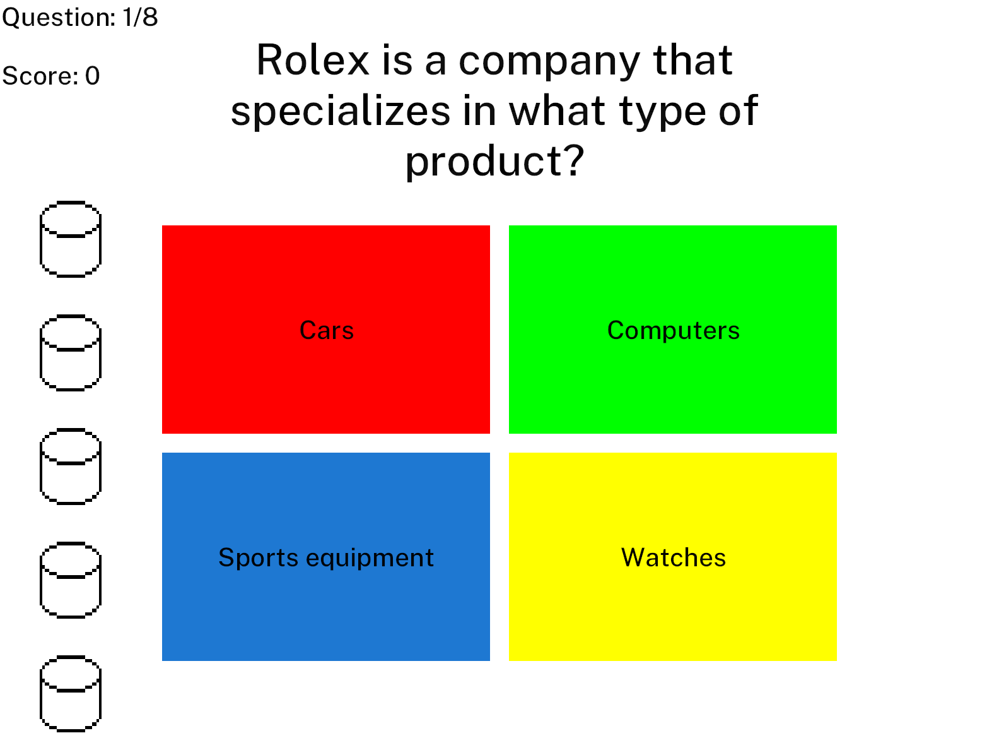
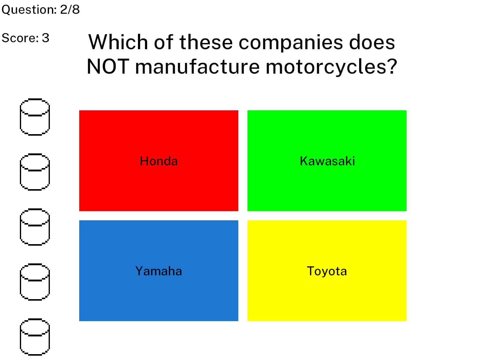

# PrettySure

## Summary
PrettySure is a trivia game, but rather than only allowing you to select one right answer, you can select several! Every question you get to wager five "tokens," which you can drag and drop to "wager" on the correct answer. Can't quite remember if it was the chicken or the egg that came first? Don't worry, just wager on both!

Once you submit, you'll be awarded points based on how many tokens you wagered on the correct answer. Every round of PrettySure consists of 8 questions, for a total possible 40 points. See how close to the full 40 you can get!

Builds can be found and downloaded on the game's [itch.io](https://markswang.itch.io/prettysure) page.

## Example Play
At first, all tokens are on the lefthand side of the screen, and colorless.

After distributing the tokens by dragging and dropping them with left click, the Submit button appears on the bottom of the screen. Note that the tokens have taken on the color of the answers they are wagered on.

After hitting Submit, points are awarded, and tokens reset for the start of another question.

Play continues until you have progressed through all 8 questions. Good luck!

## Acknowledgements
- PrettySure was written using [Bevy](https://bevyengine.org/), an open source Rust game engine.
- All questions are provided by the [OpenTDB](https://opentdb.com/) under the Creative Commons Sharealike License, 4.0.
- The [PublicSans](https://fonts.google.com/specimen/Public+Sans) font is provided under the SIL Open Font License.

## License
This work is licensed under the GNU General Public License, v3.

